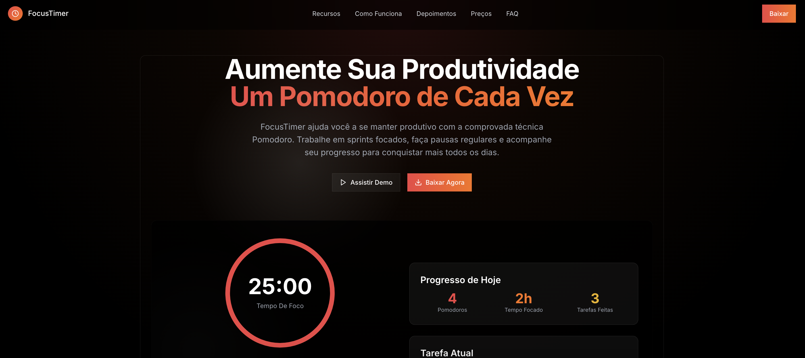

<div align="center">



<h1>
  
  FocusTimer - Pomodoro SaaS
  
</h1>

### *Plataforma SaaS de Gerenciamento de Tempo e Produtividade*
### *Maximize sua produtividade com a técnica Pomodoro definitiva*

<p align="center">
  <strong>Versão:</strong> 1.0.0 | 
  <strong>Status:</strong> Em Produção | 
  <strong>Licença:</strong> MIT
</p>

---

### 🛠️ Stack Tecnológica

<p align="center">
  
  
  
  
</p>

<p align="center">
  
  
  
  
</p>

---

[](https://vercel.com/estevam5s-projects/v0-pomodoro)
[](https://vercel.com/estevam5s-projects/v0-pomodoro)
[](#-índice)

</div>

---

## 📋 Índice

- [Sobre o Projeto](#-sobre-o-projeto)
- [Principais Funcionalidades](#-principais-funcionalidades)
- [Tecnologias Utilizadas](#-tecnologias-utilizadas)
- [Arquitetura do Projeto](#-arquitetura-do-projeto)
- [Instalação e Configuração](#-instalação-e-configuração)
- [Como Executar](#-como-executar)
- [Estrutura de Diretórios](#-estrutura-de-diretórios)
- [Melhores Práticas](#-melhores-práticas)
- [Roadmap](#-roadmap)
- [Contribuindo](#-contribuindo)
- [Licença](#-licença)

---

## 🎯 Sobre o Projeto

**FocusTimer** é uma plataforma SaaS (Software as a Service) de gerenciamento de tempo e produtividade baseada na renomada **Técnica Pomodoro**. Desenvolvido com as mais modernas tecnologias do ecossistema React, o FocusTimer oferece uma experiência única e profissional para profissionais, estudantes e equipes que buscam maximizar sua produtividade e manter o foco em suas tarefas diárias.

### 🌟 Diferenciais

- **Interface Moderna e Intuitiva**: Design minimalista com animações fluidas e componentes interativos
- **Totalmente Responsivo**: Experiência otimizada para desktop, tablet e mobile
- **Performance Excepcional**: Construído com Next.js 15 e React 19 para máxima velocidade
- **Análises em Tempo Real**: Acompanhe seu progresso com estatísticas detalhadas e visualizações inteligentes
- **Modo Escuro Premium**: Interface elegante e confortável para longas sessões de trabalho
- **Multiplataforma**: Acesse de qualquer dispositivo, seus dados sempre sincronizados

### 🎨 Experiência do Usuário

O FocusTimer foi projetado pensando na experiência do usuário, oferecendo:

- Animações suaves e transições elegantes com **Framer Motion**
- Componentes UI de alta qualidade com **Radix UI**
- Design system consistente e escalável
- Feedback visual em tempo real para todas as interações
- Acessibilidade (A11y) garantida em todos os componentes

---

## 🚀 Principais Funcionalidades

### ⏱️ Timer Pomodoro Inteligente
- Timers personalizáveis para sessões de foco (25min padrão)
- Pausas curtas (5min) e longas (15min)
- Controles intuitivos: Play, Pause e Reset
- Indicador visual de progresso circular
- Notificações sonoras ao término de cada sessão

### 📊 Dashboard de Produtividade
- **Progresso Diário**: Visualize quantos Pomodoros completou hoje
- **Tempo de Foco**: Total de tempo focado acumulado
- **Tarefas Concluídas**: Acompanhe suas conquistas do dia
- **Gráficos e Estatísticas**: Análise detalhada de sua produtividade ao longo do tempo

### ✅ Gerenciamento de Tarefas
- Lista de tarefas integrada ao timer
- Atribuição de Pomodoros por tarefa
- Status visual de tarefas (em andamento, concluída)
- Organização e priorização de atividades

### 🎯 Recursos Avançados

#### Versão Gratuita
- ✓ Timer Pomodoro básico
- ✓ Gerenciamento de tarefas
- ✓ Estatísticas diárias
- ✓ Apps mobile e desktop

#### Versão Pro (R$ 24,90/mês)
- ✓ Tudo da versão gratuita
- ✓ Durações de timer personalizadas
- ✓ Análises avançadas com gráficos
- ✓ Integração com calendário
- ✓ Bloqueador de sites durante foco
- ✓ Suporte prioritário
- ✓ Exportação de dados em CSV
- ✓ Temas customizáveis
- ✓ Sincronização em nuvem

---

## 🛠 Tecnologias Utilizadas

### Core Framework
- **[Next.js 15.2.6](https://nextjs.org/)** - Framework React com SSR e otimizações avançadas
- **[React 19](https://react.dev/)** - Biblioteca JavaScript para construção de interfaces
- **[TypeScript 5.x](https://www.typescriptlang.org/)** - Superset JavaScript com tipagem estática

### Estilização e UI
- **[Tailwind CSS 3.4.17](https://tailwindcss.com/)** - Framework CSS utility-first
- **[Tailwind Animate](https://github.com/jamiebuilds/tailwindcss-animate)** - Animações pré-configuradas
- **[Radix UI](https://www.radix-ui.com/)** - Componentes acessíveis e customizáveis
  - Accordion, Alert Dialog, Avatar, Checkbox, Dialog, Dropdown Menu
  - Hover Card, Label, Navigation Menu, Popover, Progress
  - Radio Group, Scroll Area, Select, Separator, Slider
  - Switch, Tabs, Toast, Toggle, Tooltip
- **[Framer Motion](https://www.framer.com/motion/)** - Biblioteca de animações para React
- **[Lucide React 0.454.0](https://lucide.dev/)** - Ícones modernos e otimizados

### Gerenciamento de Estado e Formulários
- **[React Hook Form 7.60.0](https://react-hook-form.com/)** - Gerenciamento performático de formulários
- **[Zod 3.25.76](https://zod.dev/)** - Validação de schemas TypeScript-first
- **[@hookform/resolvers 3.10.0](https://github.com/react-hook-form/resolvers)** - Integração React Hook Form com Zod

### Componentes Adicionais
- **[Embla Carousel 8.5.1](https://www.embla-carousel.com/)** - Carrossel performático
- **[Recharts 2.15.4](https://recharts.org/)** - Biblioteca de gráficos para React
- **[React Day Picker 9.8.0](https://react-day-picker.js.org/)** - Seletor de datas
- **[Sonner 1.7.4](https://sonner.emilkowal.ski/)** - Notificações toast elegantes
- **[date-fns 4.1.0](https://date-fns.org/)** - Manipulação moderna de datas
- **[CMDK 1.0.4](https://cmdk.paco.me/)** - Command menu para React

### Utilities
- **[Class Variance Authority 0.7.1](https://cva.style/)** - Gerenciamento de variantes de componentes
- **[clsx 2.1.1](https://github.com/lukeed/clsx)** - Construtor de classNames condicional
- **[tailwind-merge 2.5.5](https://github.com/dcastil/tailwind-merge)** - Merge inteligente de classes Tailwind

### Analytics e Performance
- **[@vercel/analytics 1.3.1](https://vercel.com/analytics)** - Analytics integrado da Vercel
- **[next-themes 0.4.6](https://github.com/pacocoursey/next-themes)** - Gerenciamento de temas (dark/light)

### Build e Desenvolvimento
- **[PostCSS 8.5](https://postcss.org/)** - Processador CSS
- **[Autoprefixer 10.4.20](https://github.com/postcss/autoprefixer)** - Adiciona prefixos CSS automaticamente
- **[ESLint](https://eslint.org/)** - Linter para JavaScript/TypeScript

---

## 🏗 Arquitetura do Projeto

O FocusTimer segue uma arquitetura moderna e escalável baseada em:

### Padrões Arquiteturais
- **Component-Driven Development**: Componentes reutilizáveis e isolados
- **Server-Side Rendering (SSR)**: Renderização no servidor com Next.js
- **Atomic Design**: Organização hierárquica de componentes
- **Composition Pattern**: Composição de componentes para máxima flexibilidade

### Otimizações
- **Code Splitting**: Carregamento otimizado de código
- **Lazy Loading**: Componentes carregados sob demanda
- **Image Optimization**: Otimização automática de imagens com Next.js
- **Font Optimization**: Carregamento otimizado de fontes
- **CSS Purging**: Remoção de CSS não utilizado em produção

---

## 💻 Instalação e Configuração

### Pré-requisitos

Certifique-se de ter instalado:
- **Node.js** (versão 18.x ou superior)
- **npm** ou **pnpm** (recomendado)
- **Git**

### Clone o Repositório

```bash
# Clone o projeto
git clone https://github.com/estevam5s/pomodoro-saas.git

# Entre no diretório
cd pomodoro-saas
```

### Instalação de Dependências

```bash
# Usando npm
npm install

# Usando pnpm (recomendado - mais rápido)
pnpm install
```

### Configuração de Ambiente

Crie um arquivo `.env.local` na raiz do projeto:

```env
# Analytics (opcional)
NEXT_PUBLIC_VERCEL_ANALYTICS_ID=your_analytics_id

# Configurações do App
NEXT_PUBLIC_APP_URL=http://localhost:2999
NEXT_PUBLIC_APP_NAME=FocusTimer
```

---

## 🚀 Como Executar

### Modo Desenvolvimento

```bash
# Inicia o servidor de desenvolvimento na porta 2999
npm run dev
# ou
pnpm dev

# Acesse em seu navegador
# http://localhost:2999
```

### Build de Produção

```bash
# Gera a build otimizada para produção
npm run build

# Inicia o servidor de produção
npm start
```

### Lint e Qualidade de Código

```bash
# Executa o ESLint
npm run lint
```

---

## 📁 Estrutura de Diretórios

```
pomodoro-saas/
├── 📁 app/                          # App Router do Next.js 15
│   ├── 📄 layout.tsx               # Layout raiz da aplicação
│   ├── 📄 page.tsx                 # Página principal (Home)
│   └── 📄 globals.css              # Estilos globais
│
├── 📁 components/                   # Componentes React
│   ├── 📁 ui/                      # Componentes de UI base
│   │   ├── 📄 button.tsx           # Componente Button
│   │   ├── 📄 gradient-card.tsx    # Card com gradiente
│   │   ├── 📄 interactive-grid.tsx # Grid interativo de background
│   │   ├── 📄 marquee.tsx          # Componente Marquee animado
│   │   └── 📄 shine-border.tsx     # Borda com efeito shine
│   │
│   ├── 📄 header.tsx               # Cabeçalho da aplicação
│   ├── 📄 navbar.tsx               # Barra de navegação
│   ├── 📄 footer.tsx               # Rodapé
│   ├── 📄 hero-section.tsx         # Seção hero da landing page
│   ├── 📄 features-section.tsx     # Seção de funcionalidades
│   ├── 📄 how-it-works-section.tsx # Seção "Como Funciona"
│   ├── 📄 testimonials-section.tsx # Seção de depoimentos
│   ├── 📄 pricing-section.tsx      # Seção de preços
│   ├── 📄 faq-section.tsx          # Seção de perguntas frequentes
│   ├── 📄 pomodoro-timer.tsx       # Timer Pomodoro principal
│   └── 📄 theme-provider.tsx       # Provider de temas
│
├── 📁 lib/                          # Utilitários e helpers
│   └── 📄 utils.ts                 # Funções utilitárias
│
├── 📁 public/                       # Arquivos estáticos
│   ├── 📄 icon.svg                 # Ícone da aplicação
│   └── 📄 placeholder-*.{svg,jpg}  # Imagens placeholder
│
├── 📁 styles/                       # Estilos adicionais
│   └── 📄 globals.css              # Estilos globais extras
│
├── 📁 docs/                         # Documentação adicional
│
├── 📄 components.json              # Configuração de componentes
├── 📄 tailwind.config.js           # Configuração Tailwind CSS
├── 📄 postcss.config.mjs           # Configuração PostCSS
├── 📄 next.config.mjs              # Configuração Next.js
├── 📄 tsconfig.json                # Configuração TypeScript
├── 📄 package.json                 # Dependências e scripts
└── 📄 README.md                    # Este arquivo
```

### Descrição dos Diretórios Principais

- **`/app`**: Utiliza o novo App Router do Next.js 15 para roteamento e layouts
- **`/components`**: Componentes React organizados por funcionalidade
- **`/components/ui`**: Componentes de interface reutilizáveis e estilizados
- **`/lib`**: Funções auxiliares, utilitários e configurações
- **`/public`**: Recursos estáticos servidos diretamente
- **`/styles`**: Estilos globais e configurações CSS

---

## ✨ Melhores Práticas

### Código

1. **TypeScript First**: Todo o código é tipado estaticamente
2. **Component Composition**: Uso extensivo de composição de componentes
3. **Custom Hooks**: Lógica reutilizável encapsulada em hooks personalizados
4. **CSS Modules**: Escopo de estilos isolado por componente
5. **Utility Classes**: Uso de Tailwind CSS para estilização consistente

### Performance

1. **Image Optimization**: Uso do componente `next/image` para otimização automática
2. **Code Splitting**: Carregamento dinâmico de componentes pesados
3. **Memoization**: Uso de `React.memo`, `useMemo` e `useCallback` quando necessário
4. **Bundle Analysis**: Monitoramento regular do tamanho do bundle

### Segurança

1. **Environment Variables**: Variáveis sensíveis em arquivos `.env`
2. **Type Safety**: TypeScript previne erros em tempo de desenvolvimento
3. **Validação de Dados**: Schemas Zod para validação robusta
4. **CSP Headers**: Content Security Policy configurada

### Acessibilidade

1. **ARIA Labels**: Atributos ARIA em todos os componentes interativos
2. **Keyboard Navigation**: Navegação completa por teclado
3. **Screen Reader Support**: Compatibilidade com leitores de tela
4. **Contrast Ratios**: Contraste adequado em todos os elementos

### SEO

1. **Meta Tags**: Meta tags otimizadas para cada página
2. **Semantic HTML**: Uso correto de tags semânticas
3. **Sitemap**: Sitemap.xml gerado automaticamente
4. **Structured Data**: Schema.org para melhor indexação

---

## 🗺 Roadmap

### Versão 1.1 (Q1 2026)
- [ ] Integração com Google Calendar
- [ ] Integração com Notion
- [ ] App mobile nativo (React Native)
- [ ] Modo offline com sincronização

### Versão 1.2 (Q2 2026)
- [ ] Relatórios semanais e mensais em PDF
- [ ] Integração com Slack/Discord
- [ ] API pública para integrações
- [ ] Gamificação e conquistas

### Versão 2.0 (Q3 2026)
- [ ] Modo colaborativo para equipes
- [ ] Dashboard de gerente/líder
- [ ] Integração com Jira/Trello
- [ ] IA para sugestões de produtividade

---

## 🤝 Contribuindo

Contribuições são sempre bem-vindas! Para contribuir:

1. Fork o projeto
2. Crie uma branch para sua feature (`git checkout -b feature/AmazingFeature`)
3. Commit suas mudanças (`git commit -m 'Add some AmazingFeature'`)
4. Push para a branch (`git push origin feature/AmazingFeature`)
5. Abra um Pull Request

### Diretrizes de Contribuição

- Siga os padrões de código existentes
- Adicione testes para novas funcionalidades
- Atualize a documentação conforme necessário
- Mantenha commits pequenos e focados

---

## 📄 Licença

Este projeto está sob a licença MIT. Veja o arquivo `LICENSE` para mais detalhes.

---

## 👨‍💻 Autor

**Estevam Silva**

- GitHub: [@estevam5s](https://github.com/estevam5s)
- LinkedIn: [Estevam Silva](https://linkedin.com/in/estevam5s)

---

## 🙏 Agradecimentos

- Francesco Cirillo pela criação da Técnica Pomodoro
- Comunidade Next.js e React
- Vercel pela plataforma de deployment
- Todos os contribuidores open-source

---

<div align="center">

**Desenvolvido com ❤️ e ☕ por [Estevam Silva](https://github.com/estevam5s)**

[](https://vercel.com/new/clone?repository-url=https://github.com/estevam5s/pomodoro-saas)

</div>